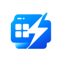
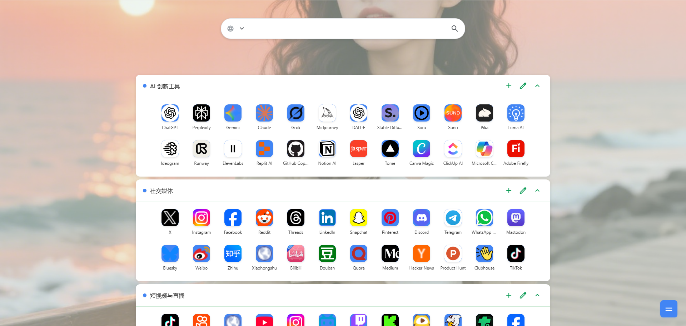

# 卡片标签页

<div align="center">
  
</div>

一个简洁、可自定义的 Chrome / Edge 新标签页扩展，用卡片方式管理常用网站与快捷方式，支持多工作空间与可选云同步。

英文说明见 `README_EN.md`。

## 功能

- 分类管理与拖拽排序
- 网格视图 / 列表视图
- `/` 快速搜索快捷方式
- 主题与背景自定义
- 右键快速添加当前网页
- 多工作空间管理
- 可选 Supabase / Cloudflare 云同步

## 安装

### Chrome Web Store

- [Card Tab - Chrome Web Store](https://chrome.google.com/webstore/detail/jaofegmijnalgabmjficlpfmmebepmbd)

### Microsoft Edge

- 支持 Microsoft Edge 使用
- 暂未上架 Edge Add-ons 商店
- 当前请先构建并解压 `build/card-tab.zip`，再打开 `edge://extensions/` 手动加载

### 本地安装（Chrome）

1. 下载或克隆本仓库
2. 打开 `chrome://extensions/`
3. 开启“开发者模式”
4. 点击“加载已解压的扩展程序”
5. 选择仓库根目录

## 快速开始

1. 新建分类
2. 为分类添加快捷方式
3. 按 `/` 打开搜索
4. 右键快捷方式进行编辑或删除
5. 在设置页管理工作空间、视图、背景和同步

## 导入预设数据

1. 下载 [`top_shortcuts_24.json`](top_shortcuts_24.json)
2. 打开设置页
3. 进入 `工作空间` → 选择工作空间 → `数据管理`
4. 点击“导入数据”并选择该文件



## 云同步

- 云同步是可选功能，默认使用本地存储
- “云端连接”页只保存全局连接资料
- 是否启用同步，需要到具体工作空间中操作
- 支持两种后端：`Supabase` 和 `Cloudflare D1/R2`

### Supabase 参数获取

1. 在 Supabase 创建项目
2. 打开 `Project Settings` → `API`，获取：
   - `Project URL`
   - `API Key (publishable / anon)`：日常连接必填
   - `Service Role Key`：仅首次初始化时需要
3. 在 Supabase 账号设置里创建 `Personal Access Token`：仅首次初始化时需要

### Supabase 使用步骤

1. 打开 `设置` → `云端连接` → `Supabase`
2. 先填写 `Project URL` 和 `API Key`
3. 如果表和 Storage Bucket 还没建好，再补充 `Service Role Key` 和 `Personal Access Token`
4. 点击 `检测状态` / `测试连接`，需要初始化时再点 `初始化连接`
5. 回到 `工作空间` → 目标工作空间 → `云同步`，点击 `启用同步`

- 如果你已经手动建好了数据表和 `backgrounds` Bucket，通常只填 `Project URL` 和 `API Key` 就够了。

### Cloudflare 参数获取

Card Tab 支持两种 Cloudflare 接入方式：

- `已经建好，直接连接`
  - 准备 `Worker API URL`
  - 如果 Worker 开启了鉴权，再准备 `Access Token`，它需要和 Worker 环境变量 `ACCESS_TOKEN` 一致
- `还没有，帮我初始化`
  - 在 Cloudflare Dashboard 获取 `Account ID`
  - 创建一个可管理 `Worker / D1 / R2` 的 `API Token`
  - 使用默认或自定义的 Worker / D1 / R2 名称
  - `同步 Worker 访问令牌` 可留空，插件会自动生成

### Cloudflare 使用步骤

1. 打开 `设置` → `云端连接` → `Cloudflare`
2. 如果已有 Worker，直接填写 `Worker API URL` 和 `Access Token`
3. 如果还没资源，切到“还没有，帮我初始化”，填写 `Account ID`、`API Token`，然后点击 `创建 Worker`
4. 拿到 `Worker API URL` 后，点击 `初始化数据库`
5. 再执行 `检测状态` / `测试连接`
6. 回到 `工作空间` → 目标工作空间 → `云同步`，点击 `启用同步`

## 开发

- 本项目是静态 Chrome 扩展，无 npm 依赖
- 构建命令：

```bash
node build.js
```

- 打包产物：`build/card-tab.zip`

## 隐私

- 默认本地优先
- 无追踪、无分析、无第三方数据收集
- 使用云同步时，数据存储在你自己的 Supabase 或 Cloudflare 资源中

## 许可证

[MIT License](LICENSE)
