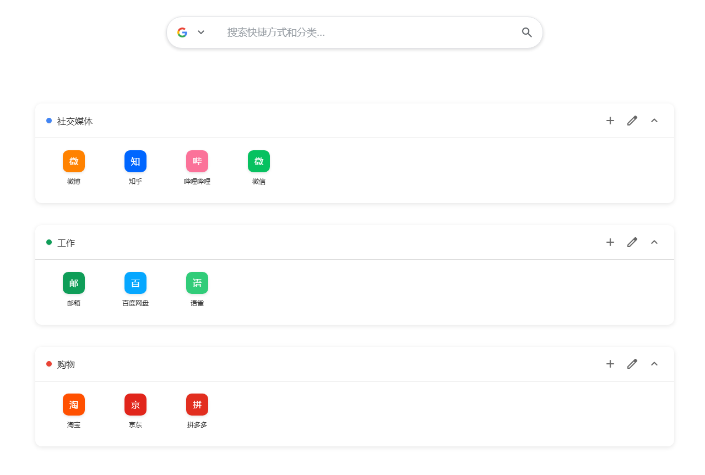

# 卡片标签页

<div align="center">
  
  <br>
  
  
  
</div>

一个现代化的、可自定义的Chrome浏览器新标签页，支持云端同步。

**卡片标签页**通过简洁、有组织的界面改变您的新标签页体验，帮助您管理书签和快捷方式。功能包括可自定义主题、通过Supabase的云端同步，以及美观的卡片式设计。

## 功能特点

- **📁 分类管理** - 创建分类，将快捷方式分组整理
- **🎯 拖拽排序** - 拖拽分类和快捷方式调整顺序
- **🔍 快速搜索** - 按 `/` 键搜索快捷方式
- **🎨 主题切换** - 6种主题可选，包括深色模式
- **🖼️ 自定义背景** - 上传图片作为背景
- **📱 视图切换** - 网格视图和列表视图
- **☁️ 云端同步** - 可选择使用Supabase同步数据
- **🌐 离线使用** - 无网络时仍可正常使用
- **⚡ 本地字体** - 内置图标字体，无需联网加载

## 截图

### 主界面展示
<div align="center">
  
  <p><i>主界面 - 默认主题</i></p>
</div>

<div align="center">
  
  <p><i>主界面 - 深色主题</i></p>
</div>

<div align="center">
  
  <p><i>主界面 - 彩色主题</i></p>
</div>

### 功能特性
<div align="center">
  
  <p><i>分类管理 - 添加和编辑分类</i></p>
</div>

<div align="center">
  
  <p><i>主题定制 - 多种主题选择</i></p>
</div>

<div align="center">
  
  <p><i>智能搜索 - 快速查找书签</i></p>
</div>

<div align="center">
  
  <p><i>云端同步 - Supabase配置</i></p>
</div>

## 安装方法

### 从Chrome Web Store安装

1. 访问[Chrome Web Store链接](#)（即将上线）
2. 点击"添加到Chrome"按钮

### 手动安装

1. 从[发布页面](../../releases)下载最新版本
2. 打开Chrome浏览器并访问 `chrome://extensions/`
3. 在右上角启用"开发者模式"
4. 点击"加载已解压的扩展程序"并选择扩展文件夹
5. 打开新标签页即可看到卡片标签页

## 快速开始

### 基本使用

1. **添加分类**：点击悬浮菜单中的"+"按钮
2. **添加快捷方式**：点击分类标题中的"+"按钮
3. **自定义**：右键点击快捷方式进行编辑或删除
4. **搜索**：按"/"聚焦搜索框，输入后按回车
5. **主题**：点击调色板图标更改主题和背景

### 云端同步设置

如需多设备同步，可选择配置Supabase云端同步：

#### 步骤1：创建Supabase项目

1. 访问 [Supabase.com](https://supabase.com)
2. 点击"Start your project"并注册
3. 创建新项目（免费版本足够）
4. 等待项目初始化（2-3分钟）

#### 步骤2：获取项目凭据

1. 在Supabase项目仪表板中，进入 **Settings** → **API**
2. 复制以下信息：
   - **项目URL**: `https://your-project.supabase.co`
   - **匿名公钥**: `eyJhbGciOiJIUzI1NiIsInR5cCI6IkpXVCJ9...`

#### 步骤3：初始化数据库

1. 在Supabase项目中进入 **SQL Editor**
2. 创建新查询
3. 复制并执行以下脚本：

```sql
-- =====================================================
-- Card Tab Chrome扩展 - Supabase初始化脚本
-- =====================================================
-- 请在Supabase项目的SQL编辑器中执行以下脚本

-- 1. 创建数据表
-- =====================================================
CREATE TABLE IF NOT EXISTS card_tab_data (
  id SERIAL PRIMARY KEY,
  user_id TEXT NOT NULL UNIQUE,
  data JSONB NOT NULL,
  created_at TIMESTAMP WITH TIME ZONE DEFAULT NOW(),
  updated_at TIMESTAMP WITH TIME ZONE DEFAULT NOW()
);

-- 创建索引提升查询性能
CREATE INDEX IF NOT EXISTS idx_card_tab_data_user_id ON card_tab_data(user_id);
CREATE INDEX IF NOT EXISTS idx_card_tab_data_updated_at ON card_tab_data(updated_at);

-- 禁用行级安全策略（简化配置，适合个人使用）
ALTER TABLE card_tab_data DISABLE ROW LEVEL SECURITY;

-- 2. 创建Storage存储桶
-- =====================================================
-- 创建backgrounds桶（用于存储背景图片）
INSERT INTO storage.buckets (id, name, public, file_size_limit, allowed_mime_types)
VALUES (
  'backgrounds',
  'backgrounds',
  true,
  52428800,  -- 50MB限制
  ARRAY['image/jpeg', 'image/png', 'image/webp', 'image/gif']
) ON CONFLICT (id) DO NOTHING;

-- Storage桶已创建，使用默认权限设置

-- 3. 验证配置
-- =====================================================
-- 检查数据表是否创建成功
SELECT 'Data table created successfully' as status
WHERE EXISTS (SELECT 1 FROM information_schema.tables WHERE table_name = 'card_tab_data');

-- 检查存储桶是否创建成功
SELECT 'Storage bucket created successfully' as status
WHERE EXISTS (SELECT 1 FROM storage.buckets WHERE id = 'backgrounds');
```

#### 步骤4：配置扩展

1. 在新浏览器标签页中打开Card Tab
2. 点击右侧的**同步按钮**（⟲图标）
3. 填写配置信息：
   - **Supabase URL**: 步骤2中的项目URL
   - **API密钥**: 步骤2中的匿名公钥
   - **用户ID**: 唯一标识符（建议使用您的邮箱）
4. 点击"测试连接"进行验证
5. 点击"启用云端同步"开始同步

### 常见问题

**连接问题：**
1. **检查网络**：确保网络连接稳定
2. **验证凭据**：仔细检查URL和API密钥
3. **检查数据库**：确保SQL脚本执行成功
4. **控制台日志**：按F12查看详细错误信息

**常见错误：**
- **PGRST116**: 数据表不存在 - 执行SQL脚本
- **401 Unauthorized**: API密钥错误或凭据过期
- **403 Forbidden**: 权限被拒绝 - 检查数据库策略

## 项目结构

```
card-tab/
├── index.html                 # 主页面入口
├── manifest.json             # Chrome扩展配置文件
├── package.json              # 项目依赖和构建脚本
├── build.js                  # 构建打包脚本
├── fonts/                    # 本地字体文件
│   ├── material-symbols-rounded.css                    # 字体样式定义
│   └── material-symbols-rounded-v255-latin-regular.woff2  # 字体文件
├── styles/                   # 样式文件
│   ├── main.css              # 主样式文件
│   └── offline-icons.css     # 离线图标样式
├── js/                       # JavaScript模块
│   ├── main.js               # 主入口文件
│   ├── storage.js            # 数据存储管理
│   ├── sync-manager.js       # 云端同步管理
│   ├── theme-config-manager.js # 主题配置管理
│   ├── offline-manager.js    # 离线功能管理
│   ├── category.js           # 分类管理
│   ├── shortcut.js           # 快捷方式管理
│   ├── search.js             # 搜索功能
│   ├── view.js               # 视图管理
│   ├── theme.js              # 主题切换
│   ├── icons.js              # 图标管理
│   ├── supabase-client.js    # Supabase客户端
│   ├── sync-ui.js            # 同步界面管理
│   ├── theme-config-ui.js    # 主题配置界面
│   ├── data-save-coordinator.js # 数据保存协调器
│   └── supabase.min.js       # Supabase SDK
├── icons/                    # 扩展图标
│   ├── icon16.png            # 16x16 图标
│   ├── icon32.png            # 32x32 图标
│   ├── icon48.png            # 48x48 图标
│   ├── icon128.png           # 128x128 图标
│   └── icon512.png           # 512x512 图标
├── store-assets/             # 商店资源
│   ├── screenshots/          # 应用截图
│   └── promotional/          # 宣传素材
├── test-local-font.html      # 字体测试页面
├── test-offline.html         # 离线功能测试页面
├── supabase-init.sql         # Supabase初始化脚本
├── privacy-policy.html       # 隐私政策
├── README.md                 # 中文说明文档
├── README_EN.md              # 英文说明文档
└── LICENSE                   # 开源许可证
```

## 技术栈

### 前端技术
- **HTML5 & CSS3**: 现代Web标准，使用自定义属性
- **JavaScript ES6+**: 模块化架构，使用async/await
- **Material Symbols**: 本地化的Google Material图标字体
- **响应式设计**: 针对不同屏幕尺寸优化
- **离线优先**: 完全离线可用的设计架构

### Chrome扩展接口
- **chrome.storage**: 本地和同步存储
- **chrome.tabs**: 新标签页覆盖功能

### 云端集成
- **Supabase**: PostgreSQL数据库
- **Supabase Storage**: 背景图片文件存储

### 性能优化
- **本地字体**: Material Symbols字体完全本地化
- **离线支持**: 智能网络状态检测和功能降级
- **缓存策略**: 旁路缓存模式提升数据同步性能

## 开发

### 构建

```bash
# 打包扩展
npm run build
```

构建脚本会创建可用于Chrome Web Store提交的`card-tab.zip`文件。

### 测试

项目包含专门的测试页面用于验证功能：

```bash
# 字体加载测试
open test-local-font.html

# 离线功能测试
open test-offline.html
```

**测试步骤：**
1. **字体测试**: 验证Material Symbols图标是否正常显示
2. **离线测试**: 使用浏览器开发者工具模拟离线状态
3. **功能测试**: 测试所有核心功能在离线状态下的表现

## 隐私与安全

- **本地优先**：默认情况下所有数据都存储在本地
- **可选云端同步**：Supabase集成完全可选
- **您的数据库**：使用云端同步时，数据存储在您自己的Supabase项目中
- **无追踪**：无分析、无数据收集、无第三方追踪
- **开源**：完整源代码可供审查

## 重要说明

- **个人使用**：每个人都应该创建自己的Supabase项目
- **用户ID**：为不同的主题配置使用不同的用户ID
- **免费额度**：Supabase免费版本足够个人使用
- **备份**：建议定期导出数据备份

## 贡献

欢迎贡献！请随时提交问题和拉取请求。

## 许可证

[MIT License](LICENSE)

---

<div align="center">
  <p>为更好的浏览体验而制作 ❤️</p>
</div>