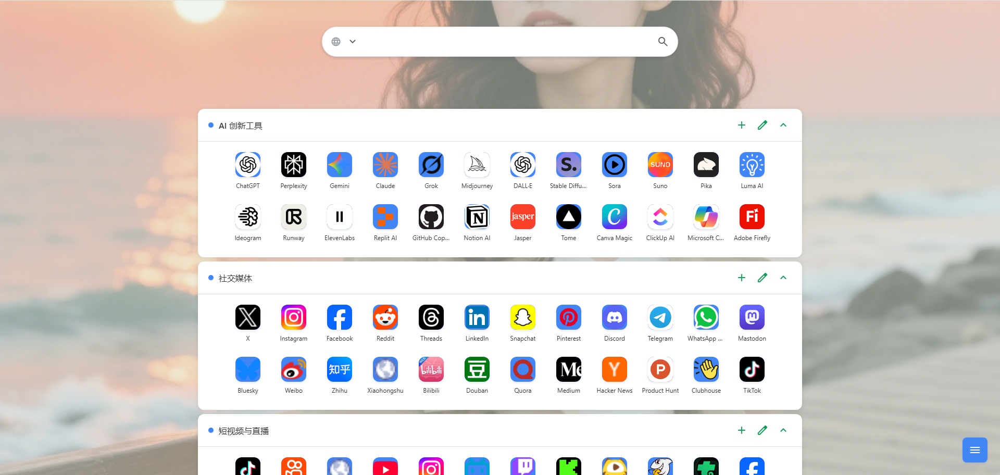

# Card Tab

<div align="center">
  
  <br>
  
  
  
</div>

A modern, customizable new tab page for Chrome browser with cloud sync support.

**Card Tab** transforms your new tab experience with a clean, organized interface for managing your bookmarks and shortcuts. Features include customizable themes, cloud synchronization via Supabase, and a beautiful card-based design.

## Features

- **📁 Category Management** - Create categories to organize shortcuts
- **🎯 Drag & Drop** - Drag categories and shortcuts to reorder
- **🔍 Quick Search** - Press `/` to search shortcuts
- **🎨 Theme Options** - 6 themes available including dark mode
- **🖼️ Custom Background** - Upload images as background
- **📱 View Modes** - Grid view and list view
- **☁️ Cloud Sync** - Optional Supabase data synchronization
- **🖱️ Right-click Add** - Quick add shortcuts from any webpage
- **⚙️ Multi-config** - Support multiple cloud configurations

## Installation

### From Chrome Web Store

1. Visit [](https://chrome.google.com/webstore/detail/jaofegmijnalgabmjficlpfmmebepmbd)
2. Click "Add to Chrome" button

### Manual Installation

1. Download the latest release from [Releases](../../releases)
2. Open Chrome and go to `chrome://extensions/`
3. Enable "Developer mode" in the top right
4. Click "Load unpacked" and select the extension folder
5. Open a new tab to see Card Tab in action

## Quick Start

### Basic Usage

1. **Add Categories**: Click the "+" button in the floating menu
2. **Add Shortcuts**: Click "+" in any category header, or right-click on any webpage and select "Card Tab 卡片式导航"
3. **Customize**: Right-click shortcuts to edit or delete
4. **Search**: Press "/" to focus search box, then type and press Enter
5. **Themes**: Click the palette icon to change themes and backgrounds
6. **Configuration Management**: Manage multiple cloud configurations in sync settings

### Quick Import Shortcuts
1. Download configuration file: [📂 Download top_shortcuts_24.json](top_shortcuts_24.json)
2. Click **Cloud Sync**
3. Click **Import Data**, select the downloaded `top_shortcuts_24.json` file
4. Wait for import completion to load preset shortcut categories



### Cloud Sync Setup

For multi-device synchronization, you can optionally configure Supabase cloud sync:

#### Step 1: Create Supabase Project

1. Visit [Supabase.com](https://supabase.com)
2. Click "Start your project" and sign up
3. Create a new project (free tier is sufficient)
4. Wait for project initialization (2-3 minutes)

#### Step 2: Get Project Credentials

1. In your Supabase project dashboard, go to **Settings** → **API**
2. Copy the following information:
   - **Project URL**: `https://your-project.supabase.co`
   - **anon public key**: `eyJhb...`

#### Step 3: Initialize Database

1. Go to **SQL Editor** in your Supabase project
2. Create a new query
3. Copy and execute the following script: [supabase-init.sql](supabase-init.sql)

#### Step 4: Configure Extension

1. Open Card Tab in a new browser tab
2. Click the **sync button** (⟲ icon) on the right side
3. Fill in the configuration:
   - **Supabase URL**: Your project URL from Step 2
   - **API Key**: Your anon public key from Step 2
   - **User ID**: A unique identifier (recommend using your email)
4. Click "Test Connection" to verify
5. Click "Enable Cloud Sync" to start syncing

### Troubleshooting

**Connection Issues:**
1. **Check Network**: Ensure stable internet connection
2. **Verify Credentials**: Double-check URL and API key
3. **Check Database**: Ensure SQL script was executed successfully
4. **Console Logs**: Press F12 to check for detailed error messages

**Common Errors:**
- **PGRST116**: Table doesn't exist - execute the SQL script
- **401 Unauthorized**: Wrong API key or expired credentials
- **403 Forbidden**: Permission denied - check database policies

## Technologies

### Frontend Technology
- **HTML5 & CSS3**: Modern web standards with custom properties
- **JavaScript ES6+**: Modular architecture with async/await
- **Material Symbols**: Localized Google Material icon fonts
- **Responsive Design**: Optimized for different screen sizes
- **Offline First**: Fully offline-capable design architecture

### Chrome Extension APIs
- **chrome.storage**: Local and sync storage
- **chrome.tabs**: New tab page override functionality
- **chrome.contextMenus**: Right-click menu quick add

### Cloud Integration
- **Supabase**: PostgreSQL database
- **Supabase Storage**: Background image file storage

## Development

### Building

```bash
# Package the extension
node build.js
```

The build script creates `card-tab.zip` ready for Chrome Web Store submission.

> **Note**: This is a pure JavaScript Chrome extension with no npm dependencies. Simply run the build script with Node.js directly.

## Privacy & Security

- **Local First**: All data stored locally by default
- **Optional Cloud Sync**: Supabase integration is completely optional
- **Your Own Database**: When using cloud sync, data goes to YOUR Supabase project
- **No Tracking**: No analytics, no data collection, no third-party tracking
- **Open Source**: Full source code available for review

## Important Notes

- **Personal Use**: Each person should create their own Supabase project
- **Theme ID**: Use different theme IDs for different theme configurations
- **Free Tier**: Supabase free tier is sufficient for personal use
- **Backup**: Regular data export is recommended

## Final

If you find it useful, please give it a Star to support us!

## License

[MIT License](LICENSE)

---

<div align="center">
  <p>Made with ❤️ for a better browsing experience</p>
</div>
