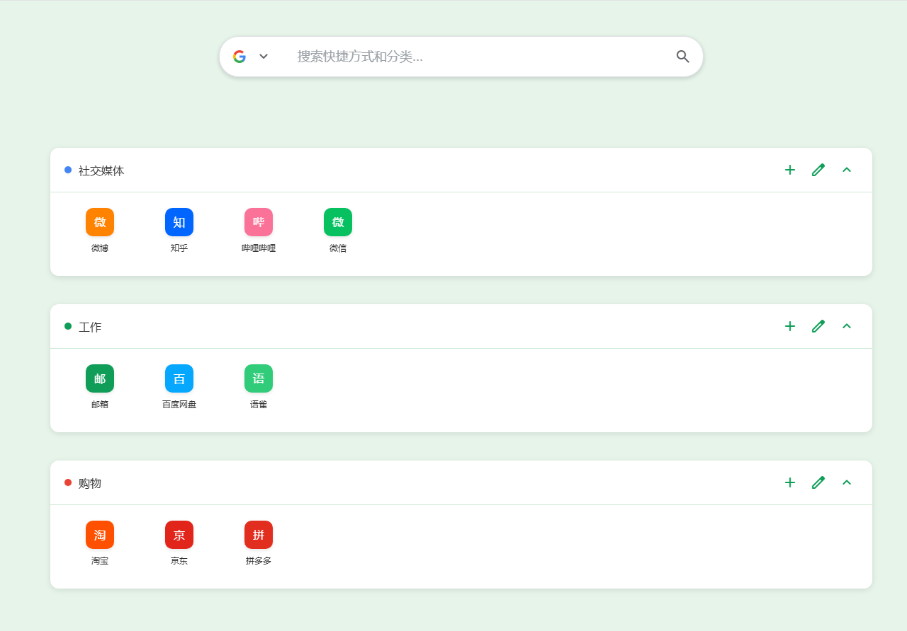
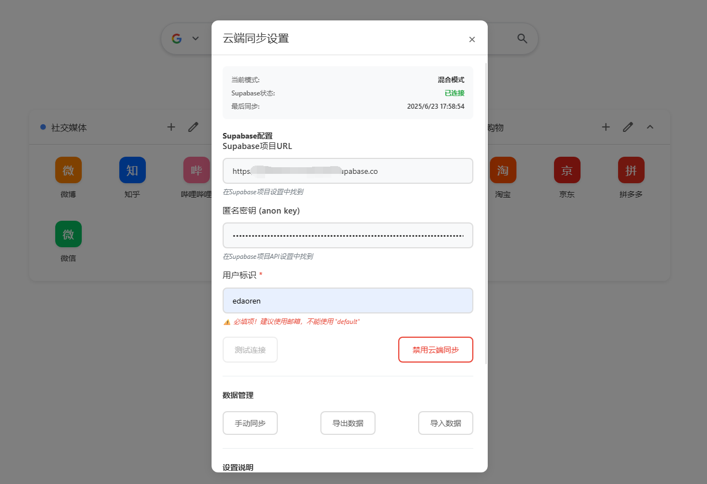

# Card Tab

<div align="center">
  
  <br>
  
  
  
</div>

A modern, customizable new tab page for Chrome browser with cloud sync support.

**Card Tab** transforms your new tab experience with a clean, organized interface for managing your bookmarks and shortcuts. Features include customizable themes, cloud synchronization via Supabase, and a beautiful card-based design.

## Features

- **📁 Categorized Bookmarks**: Organize your shortcuts into customizable categories
- **🎨 Theme Customization**: 6 beautiful themes including dark mode
- **🖼️ Custom Backgrounds**: Upload your own background images
- **☁️ Cloud Sync**: Sync data across devices using Supabase (optional)
- **🔍 Smart Search**: Quick search with "/" shortcut key
- **📱 Responsive Design**: Grid and list view modes
- **⚡ Fast & Lightweight**: Optimized performance with smooth animations
- **🔒 Privacy First**: Your data stays in your own Supabase project

## Screenshots

### Main Interface
<div align="center">
  
  <p><i>Main Interface - Default Theme</i></p>
</div>

<div align="center">
  
  <p><i>Main Interface - Dark Theme</i></p>
</div>

<div align="center">
  
  <p><i>Main Interface - Colorful Theme</i></p>
</div>

### Key Features
<div align="center">
  
  <p><i>Category Management - Add and Edit Categories</i></p>
</div>

<div align="center">
  
  <p><i>Theme Customization - Multiple Theme Options</i></p>
</div>

<div align="center">
  
  <p><i>Smart Search - Quick Bookmark Finding</i></p>
</div>

<div align="center">
  
  <p><i>Cloud Sync - Supabase Configuration</i></p>
</div>

## Installation

### From Chrome Web Store

1. Visit the [Chrome Web Store link](#) (coming soon)
2. Click "Add to Chrome" button

### Manual Installation

1. Download the latest release from [Releases](../../releases)
2. Open Chrome and go to `chrome://extensions/`
3. Enable "Developer mode" in the top right
4. Click "Load unpacked" and select the extension folder
5. Open a new tab to see Card Tab in action

## Quick Start

### Basic Usage

1. **Add Categories**: Click the "+" button in the floating menu
2. **Add Shortcuts**: Click "+" in any category header
3. **Customize**: Right-click shortcuts to edit or delete
4. **Search**: Press "/" to focus search box, then type and press Enter
5. **Themes**: Click the palette icon to change themes and backgrounds

### Cloud Sync Setup

For multi-device synchronization, you can optionally configure Supabase cloud sync:

#### Step 1: Create Supabase Project

1. Visit [Supabase.com](https://supabase.com)
2. Click "Start your project" and sign up
3. Create a new project (free tier is sufficient)
4. Wait for project initialization (2-3 minutes)

#### Step 2: Get Project Credentials

1. In your Supabase project dashboard, go to **Settings** → **API**
2. Copy the following information:
   - **Project URL**: `https://your-project.supabase.co`
   - **anon public key**: `eyJhbGciOiJIUzI1NiIsInR5cCI6IkpXVCJ9...`

#### Step 3: Initialize Database

1. Go to **SQL Editor** in your Supabase project
2. Create a new query
3. Copy and execute the complete script below:

```sql
-- =====================================================
-- Card Tab Chrome Extension - Supabase Setup Script
-- =====================================================
-- Execute this script in your Supabase project's SQL Editor

-- 1. Create Data Table
-- =====================================================
CREATE TABLE IF NOT EXISTS card_tab_data (
  id SERIAL PRIMARY KEY,
  user_id TEXT NOT NULL UNIQUE,
  data JSONB NOT NULL,
  created_at TIMESTAMP WITH TIME ZONE DEFAULT NOW(),
  updated_at TIMESTAMP WITH TIME ZONE DEFAULT NOW()
);

-- Create indexes for performance
CREATE INDEX IF NOT EXISTS idx_card_tab_data_user_id ON card_tab_data(user_id);
CREATE INDEX IF NOT EXISTS idx_card_tab_data_updated_at ON card_tab_data(updated_at);

-- Disable Row Level Security (simplified setup for personal use)
ALTER TABLE card_tab_data DISABLE ROW LEVEL SECURITY;

-- 2. Create Storage Bucket
-- =====================================================
-- Create backgrounds bucket for storing background images
INSERT INTO storage.buckets (id, name, public, file_size_limit, allowed_mime_types)
VALUES (
  'backgrounds',
  'backgrounds',
  true,
  52428800,  -- 50MB limit
  ARRAY['image/jpeg', 'image/png', 'image/webp', 'image/gif']
) ON CONFLICT (id) DO NOTHING;

-- Storage bucket created with default permissions

-- 3. Verify Setup
-- =====================================================
-- Check if data table was created successfully
SELECT 'Data table created successfully' as status
WHERE EXISTS (SELECT 1 FROM information_schema.tables WHERE table_name = 'card_tab_data');

-- Check if storage bucket was created successfully
SELECT 'Storage bucket created successfully' as status
WHERE EXISTS (SELECT 1 FROM storage.buckets WHERE id = 'backgrounds');
```

#### Step 4: Configure Extension

1. Open Card Tab in a new browser tab
2. Click the **sync button** (⟲ icon) on the right side
3. Fill in the configuration:
   - **Supabase URL**: Your project URL from Step 2
   - **API Key**: Your anon public key from Step 2
   - **User ID**: A unique identifier (recommend using your email)
4. Click "Test Connection" to verify
5. Click "Enable Cloud Sync" to start syncing

### Troubleshooting

**Connection Issues:**
1. **Check Network**: Ensure stable internet connection
2. **Verify Credentials**: Double-check URL and API key
3. **Check Database**: Ensure SQL script was executed successfully
4. **Console Logs**: Press F12 to check for detailed error messages

**Common Errors:**
- **PGRST116**: Table doesn't exist - execute the SQL script
- **401 Unauthorized**: Wrong API key or expired credentials
- **403 Forbidden**: Permission denied - check database policies

## Technologies

### Frontend
- **HTML5 & CSS3**: Modern web standards with custom properties
- **JavaScript ES6+**: Modular architecture with async/await
- **Material Design**: Google Material Symbols for consistent UI
- **Responsive Design**: Optimized for different screen sizes

### Chrome Extension APIs
- **chrome.storage**: Local and sync storage for data persistence
- **chrome.tabs**: New tab page override functionality

### Cloud Integration
- **Supabase**: PostgreSQL database with real-time capabilities
- **Supabase Storage**: File storage for background images

## Development

### Building

```bash
# Package the extension
npm run build
```

The build script creates `quick-nav-tab.zip` ready for Chrome Web Store submission.

## Privacy & Security

- **Local First**: All data stored locally by default
- **Optional Cloud Sync**: Supabase integration is completely optional
- **Your Own Database**: When using cloud sync, data goes to YOUR Supabase project
- **No Tracking**: No analytics, no data collection, no third-party tracking
- **Open Source**: Full source code available for review

## Important Notes

- **Personal Use**: Each person should create their own Supabase project
- **User ID**: Use different user IDs for different theme configurations
- **Free Tier**: Supabase free tier is sufficient for personal use
- **Backup**: Regular data export is recommended

## Contributing

Contributions are welcome! Please feel free to submit issues and pull requests.

## License

[MIT License](LICENSE)

---

<div align="center">
  <p>Made with ❤️ for a better browsing experience</p>
</div>
